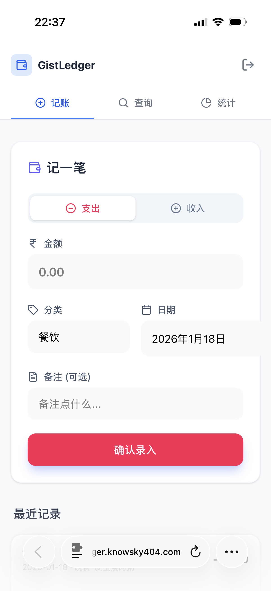
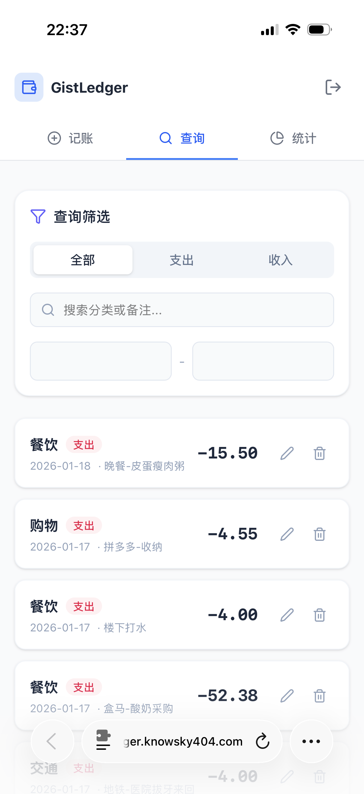
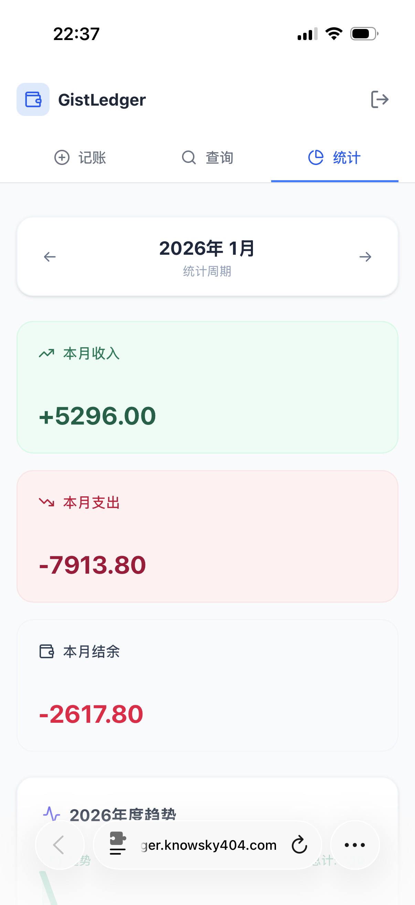

# GistLedger / 云笺账本

**GistLedger** 是一个基于 GitHub Gist 的极简个人记账应用。它利用 GitHub Gist 作为免费、私有的云端数据库，实现数据的安全存储与多端同步。

🌐 **核心理念**: Own your data (数据隐私) | Serverless (无后端) | Lightweight (轻量化)

> 当前状态：`云笺账本 / GistLedger` 已支持中英双语、深色模式、月预算、固定模板与模板提醒、响应式桌面布局，以及本地化金额/日期/导出格式。

[](https://deploy.workers.cloudflare.com/?url=https://github.com/KnowSky404/gist-ledger)

## 📸 项目预览

<div align="center">
    
    
    
</div>

## ✨ 功能特性

### 1. 📝 极简记账 (Journal)
*   **快速录入**: 支持收入/支出切换，金额、分类、日期、备注一键录入。
*   **自定义分类 + 智能建议**: 分类输入支持自由填写，同时会基于内置分类和历史记录给出常用建议。
*   **快捷日期**: 支持“今天 / 昨天 / 月初”一键填充，连续记账更顺手。
*   **固定模板**: 支持保存房租、订阅、工资等固定账单模板，并可一键录入当月账单。
*   **模板提醒**: 自动识别本月待记与即将到期的固定模板，并在首页提供快速记账入口。
*   **中英双语界面**: 右上角图标菜单一键切换中文 / English，桌面端与移动端都能保持一致体验。
*   **深色模式**: 右上角图标菜单支持浅色 / 深色 / 跟随系统，并会记住你的主题偏好。
*   **最近记录**: 首页实时展示最近 5 笔交易，方便快速核对。
*   **完全私有**: 数据仅存储在你的 GitHub Gist 中，无第三方服务器读取。

### 2. 📊 统计报表 (Statistics)
*   **双重视图**:
    *   **月度视图**: 聚焦本月收支，展示**当年12个月**的收支变化趋势，辅助判断本月消费水位。
    *   **年度视图**: 聚焦全年收支，展示**近5年**的长期收支变化趋势，掌握宏观财务健康状况。
*   **多维筛选**: 支持按**分类**（可多选）筛选统计数据，例如查看“餐饮”+“交通”的年度支出趋势。
*   **动态图表**: 交互式图表实时响应筛选和日期切换。
*   **分类占比与关键洞察**: 新增支出/收入分类占比、储蓄率、上一周期对比，帮助快速看出财务结构变化。
*   **月预算与超支提醒**: 支持设置每月支出预算，并在统计页和录入页实时提示剩余额度、预计月末支出与超支风险。

### 3. 🔍 查询管理 (Query)
*   **多维筛选**: 支持按类型（收入/支出）、日期范围、关键词（分类/备注）进行组合查询。
*   **快捷时间范围**: 支持本月、近30天、今年、全部等一键筛选。
*   **排序与导出**: 支持按日期/金额排序，并可将当前筛选结果导出为 CSV / JSON。
*   **本地化金额与日期格式**: 页面展示与 CSV 导出会根据中文 / English 环境自动调整金额与日期格式。
*   **数据管理**: 支持对历史记录进行**修改**或**删除**。
*   **客户端分页**: 即使数据量大也能流畅分页浏览。
*   **响应式布局**: 针对桌面端扩大了信息密度，查询页采用侧栏 + 结果区布局，首页与统计页也会更充分利用宽屏空间。

### 4. ☁️ 同步体验优化
*   **同步状态可见**: 顶部会实时显示“正在同步 / 云端已同步 / 同步失败”。
*   **失败自动回滚**: 保存失败时会恢复到上一次成功状态，避免界面数据与 Gist 数据不一致。


## 🤝 协作约定

- 仓库维护约束：每一次实际变动完成后，都应立即提交一次 `git commit`。
- 如果一轮工作同时包含功能改动和文档/流程调整，建议拆成两次提交，保持历史清晰。
- 凡是影响功能、命名、工作流或使用方式的改动，都要同步更新 `README.md`。

## 🛠 技术栈

*   **框架**: [React 19](https://react.dev/) + [TypeScript](https://www.typescriptlang.org/)
*   **构建工具**: [Vite](https://vitejs.dev/)
*   **样式**: [Tailwind CSS v4](https://tailwindcss.com/)
*   **图标**: [Lucide React](https://lucide.dev/)
*   **API**: [Octokit](https://github.com/octokit/octokit.js) (GitHub REST API)
*   **部署**: Cloudflare Workers / GitHub Pages

## 🚀 快速开始

### 前置准备
1.  拥有一个 GitHub 账号。
2.  生成一个 [GitHub Personal Access Token (Classic)](https://github.com/settings/tokens)。
    *   **Scope 权限**: 必须勾选 `gist` 权限。

### 本地运行

```bash
# 1. 克隆项目
git clone https://github.com/KnowSky404/gist-ledger.git
cd gist-ledger

# 2. 安装依赖 (推荐使用 bun)
bun install

# 3. 启动开发服务器
bun run dev
```

### 部署到 Cloudflare Workers

#### 方式 1: 一键部署

点击文档顶部的 **Deploy to Cloudflare Workers** 按钮，按 Cloudflare 引导完成仓库导入与部署。

#### 方式 2: Wrangler CLI（推荐本仓库维护者使用）

```bash
# 1. 登录 Cloudflare
bunx wrangler login

# 2. 本地预览 Workers 版本
bun run cf:dev

# 3. 发布到 Cloudflare Workers
bun run cf:deploy
```

> 本项目已内置 `wrangler.toml`，使用静态资源托管（`assets.directory = "./dist"`）并启用 SPA 路由回退（`not_found_handling = "single-page-application"`）。

#### 自定义域名迁移（从 Pages 切到 Workers）

1. 先在 `*.workers.dev` 地址验证页面正常。
2. 从 Cloudflare Pages 项目里解绑原自定义域名。
3. 在 Workers 项目中绑定同一个自定义域名。

### 使用说明

1.  打开应用后，在登录页输入你的 **GitHub Personal Access Token**。
2.  点击 **"连接数据库"**。
    *   如果是首次使用，应用会自动在你的 Gist 中创建一个名为 `GistLedger-Data` 的私有 Gist 和 `ledger_data.json` 文件。
    *   如果已有数据，会自动同步拉取。
3.  开始记账！你的 Token 和 Gist ID 会保存在本地浏览器缓存中，下次访问无需重复输入（除非清除缓存或点击退出）。

## 🔒 数据安全

*   应用**不会**将你的 Token 发送给除 GitHub API 以外的任何服务器。
*   数据存储在你的**私有 Gist** 中，只有拥有该 Token 的人才能访问。预算等设置会与账本一起同步保存。
*   建议定期备份 Gist 数据或使用 GitHub 的版本历史功能回滚误操作。

## 📄 License

GNU General Public License v3.0 (GPL-3.0)
